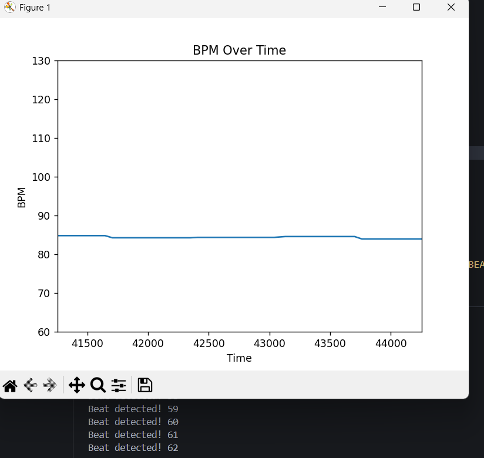
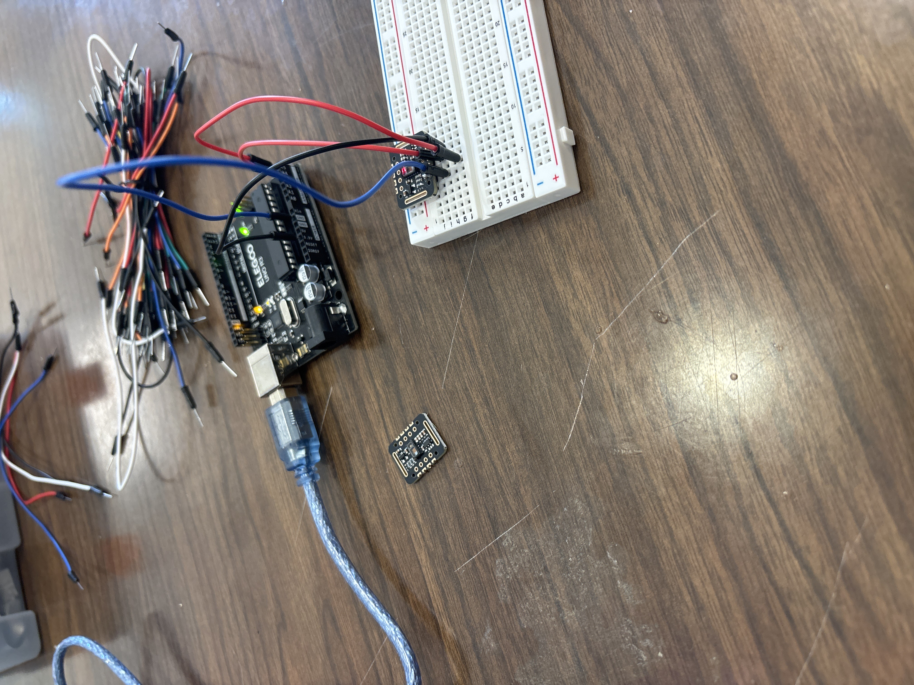

# Heart-Rate-Visualizer

A Python-based heart rate monitoring and visualization tool using Arduino and the MAX30102 sensor.

Designed to improve accuracy and provide clear visual feedback of heart rate data in real-time.

## Features
- Real-time heart rate monitoring via MAX30102 and Arduino
- Custom beat detection algorithm with moving average filter
- Data visualization with Matplotlib
- Readings within 1% of commercial devices (Garmin, Apple)
  

## Device Demo



- **BPM displayed live**
- **Console logs** each detected beat



- **MAX30102 + Arduino setup**
- Note: Finger is placed on the shining red light

  

## Setup Instructions
### Hardware
1. Connect the MAX30102 sensor to the Arduino
2. Upload `bpm-reader.ino` to the Arduino board via the Arduino IDE
### Software
1. Clone this repo
```bash
git clone https://github.com/nick-cortes/Heart-Rate-Visualizer.git
```
2. Install Python Dependencies
```bash
pip install scipy
pip install matplotlib
pip install numpy
pip install pyserial
```
3. Run the script
```bash
python bpm-plotter.py
```

## Credits

Made by Nicholes Cortes (@nick-cortes).
For a detailed documentation of the build process, [see my porfolio](https://nick-cortes.github.io/portfolio.html).